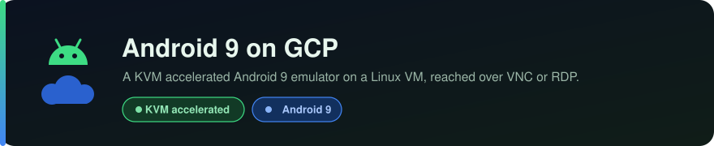
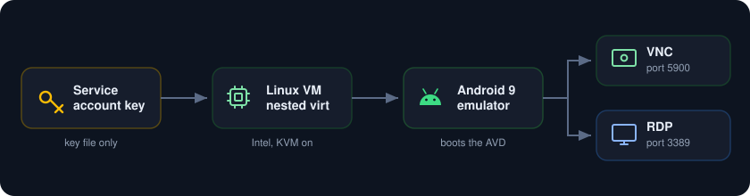
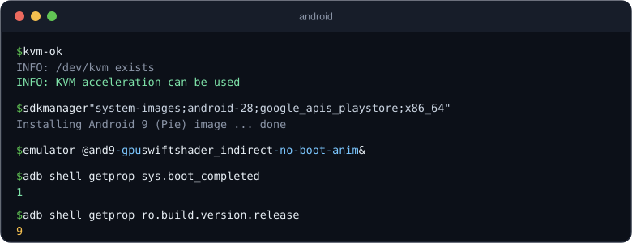
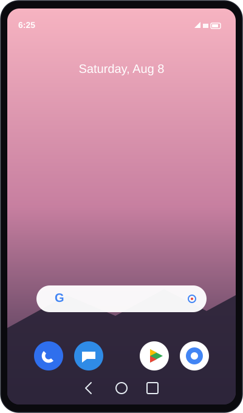

<p align="center">
  
</p>

Run a real Android 9 (Pie) emulator on Google Cloud, hardware accelerated with KVM, and reach it from anywhere over VNC or RDP.

<p align="center">
  
</p>

##  What you need

* A Google Cloud project with billing turned on.
* A service account key JSON file with Compute Admin rights. This is the only credential.
* This must be an Intel Linux VM with nested virtualization. GCP gives the CPU virtualization instructions to Linux guests only, and that is exactly what the Android emulator needs to run fast. Windows guests never get it, which is why BlueStacks and other Windows emulators cannot run on a GCP Windows VM. AMD is not supported for GCP nested virtualization, so pick an Intel machine type.
* A VNC client, and optionally an RDP client.

##  Authenticate with the service account key

Point gcloud at the key file and set the project. 
```
gcloud auth activate-service-account --key-file=service_account.json
gcloud config set project YOUR_PROJECT_ID
```

If you want no CLI at all, load the key in Python and call the Compute REST API directly.

```
from google.oauth2 import service_account
from google.auth.transport.requests import AuthorizedSession
creds = service_account.Credentials.from_service_account_file(
    "service_account.json", scopes=["https://www.googleapis.com/auth/cloud-platform"])
session = AuthorizedSession(creds)
```

##  1. Create a Linux VM with nested virtualization

Use Ubuntu, an Intel machine type, and turn on nested virtualization. This is the one setting that makes the whole thing possible.

```
gcloud compute instances create android9 \
  --zone us-east1-b \
  --machine-type n2-standard-4 \
  --enable-nested-virtualization \
  --image-family ubuntu-2204-lts \
  --image-project ubuntu-os-cloud \
  --boot-disk-size 120GB \
  --boot-disk-type pd-ssd
```

Note the external IP. The `--enable-nested-virtualization` flag is the whole point. It exposes `/dev/kvm` inside the VM so the emulator can use hardware acceleration.

##  2. Open the ports in the firewall

You need port 22 for SSH (usually open already) and port 5900 for VNC. Add 3389 only if you plan to use the RDP bridge. Set the source range to your own IP.

```
gcloud compute firewall-rules create allowvnc --allow tcp:5900 --source-ranges YOUR_IP/32
```

##  3. SSH in and confirm KVM

```
ssh ubuntu@EXTERNAL_IP
ls -l /dev/kvm
sudo apt-get update && sudo apt-get install -y cpu-checker
kvm-ok
```

You want to see `KVM acceleration can be used`. If you do, the emulator will run at near native speed. If `/dev/kvm` is missing, the VM was not created with nested virtualization or it is not an Intel machine.

<p align="center">
  
</p>

##  4. Install the Android SDK and the Android 9 image

Install a JDK and the command line tools, then pull the platform tools, the emulator, and the Android 9 system image. The `google_apis_playstore` image is Android 9 (Pie) with the Play Store.

```
sudo apt-get install -y openjdk-17-jdk-headless unzip wget
sudo mkdir -p /opt/android-sdk/cmdline-tools
cd /tmp
wget -q https://dl.google.com/android/repository/commandlinetools-linux-11076708_latest.zip -O cmt.zip
sudo unzip -q cmt.zip -d /opt/android-sdk/cmdline-tools
sudo mv /opt/android-sdk/cmdline-tools/cmdline-tools /opt/android-sdk/cmdline-tools/latest
sudo chown -R $USER /opt/android-sdk

export ANDROID_SDK_ROOT=/opt/android-sdk
export PATH=$ANDROID_SDK_ROOT/cmdline-tools/latest/bin:$ANDROID_SDK_ROOT/platform-tools:$ANDROID_SDK_ROOT/emulator:$PATH

yes | sdkmanager --licenses >/dev/null
sdkmanager "platform-tools" "emulator" "platforms;android-28" "system-images;android-28;google_apis_playstore;x86_64"
```

##  5. Create the virtual device

```
echo no | avdmanager create avd -n and9 \
  -k "system-images;android-28;google_apis_playstore;x86_64" -d pixel_2
```

##  6. Run it and serve the screen

The emulator needs a display and there is no monitor on a server, so run a virtual display with Xvfb, start the emulator on it, then share that display over VNC with x11vnc. Your user must be in the kvm group first.

```
sudo usermod -aG kvm $USER    # log out and back in so the group applies
sudo apt-get install -y xvfb x11vnc

export DISPLAY=:1
Xvfb :1 -screen 0 1400x900x24 &
emulator @and9 -gpu swiftshader_indirect -no-boot-anim -no-audio -no-snapshot &
x11vnc -display :1 -forever -shared -rfbport 5900 -passwd YOUR_VNC_PASSWORD &
```

The first cold boot takes a couple of minutes. Confirm it is up:

```
adb wait-for-device
adb shell getprop sys.boot_completed     # 1 means ready
adb shell getprop ro.build.version.release   # 9
```

For a setup that survives reboots, wrap Xvfb, the emulator, and x11vnc as three systemd services set to restart always. Then Android comes back on its own after any restart.

##  7. Connect

* VNC: point a VNC client at `EXTERNAL_IP:5900` and enter your VNC password. You land on the Android 9 home screen.
* RDP, optional: install xrdp and add a session that connects to the local VNC on `127.0.0.1:5900`, so an RDP client on port 3389 shows the same Android screen.

<p align="center">
  
</p>

##  Notes

* This works on a Linux VM with nested virtualization. GCP does not expose the virtualization instructions to Windows VMs, so there is no way to run BlueStacks or a Windows Android emulator on a GCP Windows instance. The Linux emulator is the path that works on GCP.
* Graphics are software rendered with SwiftShader because the VM has no GPU. That is fine for apps and the interface, but not for heavy 3D games. The Android system itself runs on the CPU with KVM acceleration, so it feels responsive.
* Keep the VNC port closed to the internet or limited to your own IP. VNC passwords are weak.
* Stop or delete the VM when you are not using it so it does not keep billing.
