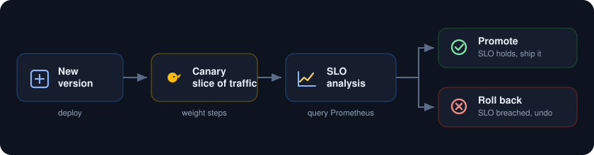
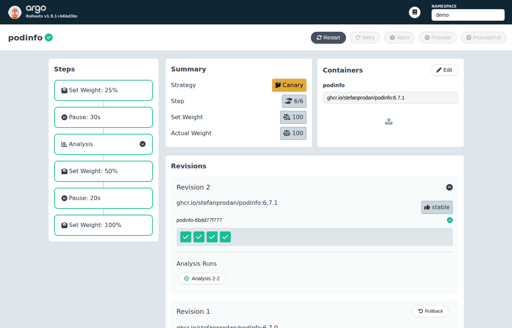
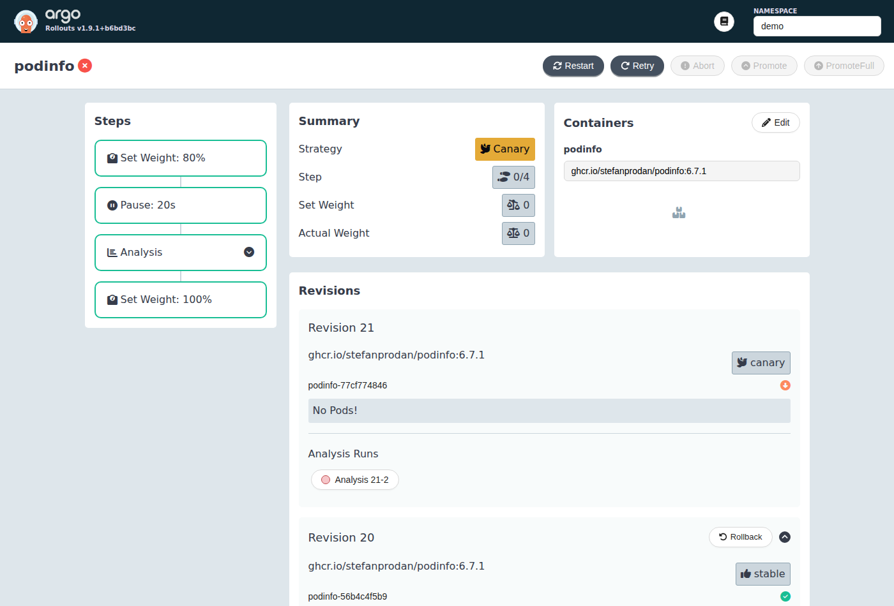
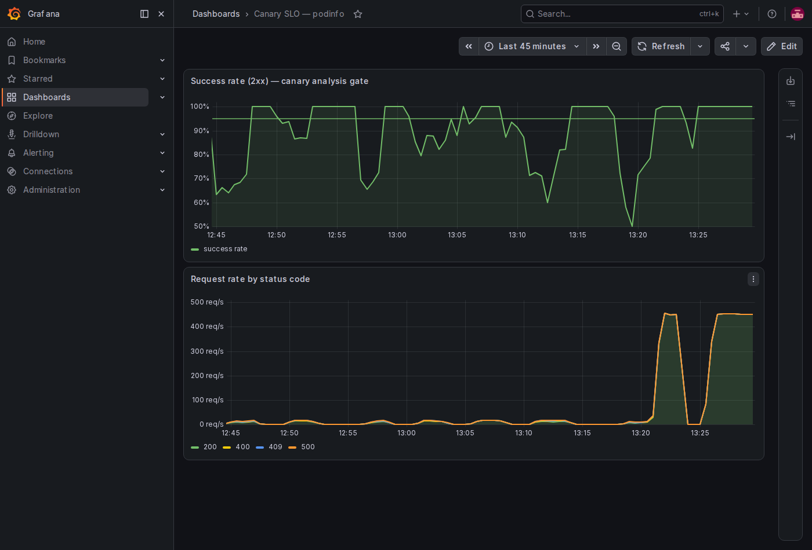

<p align="center">
  
</p>

Ship a new version to a slice of traffic, let it watch its own error rate on Prometheus, and let it decide. If the version stays healthy it promotes itself to everyone. If it starts throwing errors it rolls itself back to the last good version, with no human in the loop. The metric that makes the call is the same one on your Grafana board, so releases are governed by your real SLOs.

<p align="center">
  
</p>

##  What you need

* A Google Cloud project with billing turned on.
* A service account key JSON file with Kubernetes Engine Admin rights. This is the only credential. No browser sign in.
* The gcloud CLI with the `gke-gcloud-auth-plugin` component, plus `kubectl` and `helm`.
* About 8 vCPU of headroom. Everything here fits on a two node `e2-standard-4` cluster.

##  Authenticate with the service account key

Point gcloud at the key and set the project. There is no sign in prompt.

```
gcloud auth activate-service-account --key-file=service_account.json
gcloud config set project YOUR_PROJECT_ID
gcloud config set compute/zone us-central1-a
```

Every command below runs as that service account.

##  1. Create the cluster

A small Standard cluster is plenty. Two `e2-standard-4` nodes give you eight vCPU, which holds the monitoring stack, the rollout controller, and the demo app at once.

```
gcloud container clusters create canary-lab \
  --zone us-central1-a \
  --num-nodes 2 --machine-type e2-standard-4 \
  --release-channel regular --enable-ip-alias \
  --scopes cloud-platform

gcloud container clusters get-credentials canary-lab --zone us-central1-a
```

##  2. Install Prometheus, Grafana, and Argo Rollouts

Add the charts:

```
helm repo add prometheus-community https://prometheus-community.github.io/helm-charts
helm repo add argo https://argoproj.github.io/argo-helm
helm repo update
```

Install the monitoring stack. The values file keeps it small and, importantly, sets `serviceMonitorSelectorNilUsesHelmValues: false` so Prometheus picks up the ServiceMonitor you add later.

```
kubectl create namespace monitoring
helm install kube-prometheus-stack prometheus-community/kube-prometheus-stack \
  -n monitoring -f kps-values.yaml --wait
```

Install the rollout controller and its dashboard:

```
helm install argo-rollouts argo/argo-rollouts \
  -n argo-rollouts --create-namespace \
  --set dashboard.enabled=true --wait
```

Grab the `kubectl argo rollouts` plugin too, it is the nicest way to watch a rollout:

```
curl -sSL -o kubectl-argo-rollouts \
  https://github.com/argoproj/argo-rollouts/releases/latest/download/kubectl-argo-rollouts-linux-amd64
chmod +x kubectl-argo-rollouts && sudo mv kubectl-argo-rollouts /usr/local/bin/
```

##  3. Deploy the app as a Rollout with an SLO gate

The full manifest is [rollout.yaml](rollout.yaml). It has four pieces in one namespace called `demo`:

* a **Rollout** of `podinfo` with a canary strategy: step to 80 percent, pause, then run an analysis, then go to 100 percent,
* an **AnalysisTemplate** that queries Prometheus for the success rate and passes only when it stays at or above 0.95,
* a **Service** and a **ServiceMonitor** so Prometheus scrapes the app,
* a small **load generator** so there is steady traffic to measure.

The gate is one PromQL query. Success is the share of requests that answer with a 2xx, ignoring the health and readiness probes:

```
sum(rate(http_request_duration_seconds_count{namespace="demo",path!~"healthz|readyz|livez",status=~"2.."}[40s]))
/
sum(rate(http_request_duration_seconds_count{namespace="demo",path!~"healthz|readyz|livez"}[40s]))
```

Apply it:

```
kubectl apply -f rollout.yaml
```

##  4. Watch a good deploy promote itself

Ship a new image. This is a real version bump that stays healthy.

```
kubectl argo rollouts set image podinfo \
  podinfo=ghcr.io/stefanprodan/podinfo:6.7.1 -n demo

kubectl argo rollouts get rollout podinfo -n demo --watch
```

The canary takes its slice, the analysis reads the success rate, sees it holding at 1.0, and promotes the new version to stable on its own. Open the dashboard to watch it happen:

```
kubectl port-forward -n argo-rollouts svc/argo-rollouts-dashboard 3100:3100
# then open http://localhost:3100 and set the namespace box to demo
```

<p align="center">
  
</p>

The analysis run is green and the new revision is marked stable. Nobody clicked promote.

##  5. Watch a bad deploy roll back itself

Now ship a version that misbehaves. The `--random-error` flag makes podinfo answer a share of requests with 400, 409, and 500 instead of 200.

```
kubectl patch rollout podinfo -n demo --type merge -p \
  '{"spec":{"template":{"spec":{"containers":[{"name":"podinfo","image":"ghcr.io/stefanprodan/podinfo:6.7.1","args":["./podinfo","--port=9898","--random-error=true"]}]}}}}'
```

The canary goes out at 80 percent, the success rate drops below the 0.95 gate, the analysis fails on its first bad reading, and the controller scales the canary to zero and returns to the stable version. Degraded, then safe, on its own.

<p align="center">
  
</p>

The bad revision shows No Pods, its analysis run is red, and traffic is back on the last good version.

##  6. The one board that decides

Both outcomes are driven by a single metric, and that metric lives on Grafana next to everything else. The top panel is the success rate with a line at the 0.95 gate. The dips below the line are the bad versions. The bottom panel breaks the traffic out by status code so you can see the 4xx and 5xx arrive.

```
kubectl port-forward -n monitoring svc/kube-prometheus-stack-grafana 3000:80
# open http://localhost:3000, user admin, password from kps-values.yaml
```

<p align="center">
  
</p>

##  Notes

* Gate on 2xx, not on "not 5xx". A version that rains 400s and 409s is still broken, and counting those as success is how a bad canary sneaks through.
* Measure over a short window and give the analysis an `initialDelay`. If the query averages over a long window it is still full of pre canary traffic when the first reading lands, so the bad version looks fine until it is already promoted.
* Run the analysis at a weight where the signal is real. At a tiny weight a modest error rate barely moves the blended number. Set `failureLimit: 0` if you want it to bail on the first breach.
* To stop paying while idle, delete the cluster when you are done: `gcloud container clusters delete canary-lab --zone us-central1-a`.
