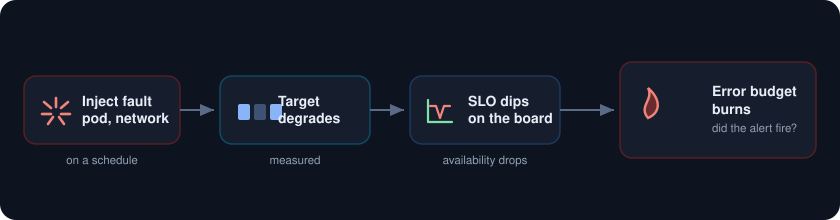
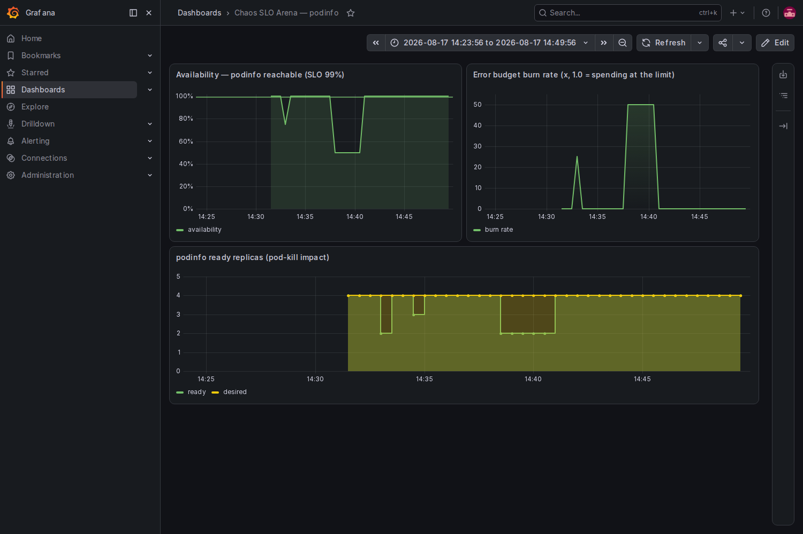

<p align="center">
  
</p>

Break the cluster on purpose with Chaos Mesh and watch the error budget burn in real time on Grafana. Instead of just causing failure, you measure exactly how much of your budget each fault spends and whether it would have tripped an alert. A game day turns into hard evidence.

<p align="center">
  
</p>

##  What you need

* A Google Cloud project with billing turned on.
* A service account key JSON file with Kubernetes Engine Admin rights. This is the only credential.
* The gcloud CLI with the `gke-gcloud-auth-plugin` component, plus `kubectl` and `helm`.
* About 8 vCPU of headroom. A two node `e2-standard-4` cluster is plenty.

##  Authenticate with the service account key

```
gcloud auth activate-service-account --key-file=service_account.json
gcloud config set project YOUR_PROJECT_ID
gcloud config set compute/zone us-central1-a
```

##  1. Create the cluster

```
gcloud container clusters create chaos-lab \
  --zone us-central1-a \
  --num-nodes 2 --machine-type e2-standard-4 \
  --release-channel regular --enable-ip-alias --scopes cloud-platform

gcloud container clusters get-credentials chaos-lab --zone us-central1-a
```

##  2. Install Prometheus, Grafana, and Chaos Mesh

```
helm repo add prometheus-community https://prometheus-community.github.io/helm-charts
helm repo add chaos-mesh https://charts.chaos-mesh.org
helm repo update

kubectl create namespace monitoring
helm install kube-prometheus-stack prometheus-community/kube-prometheus-stack \
  -n monitoring -f kps-values.yaml --wait
```

Chaos Mesh needs to reach the container runtime. On GKE the nodes run containerd, so point the daemon at its socket:

```
helm install chaos-mesh chaos-mesh/chaos-mesh -n chaos-mesh --create-namespace \
  --set chaosDaemon.runtime=containerd \
  --set chaosDaemon.socketPath=/run/containerd/containerd.sock \
  --wait
```

##  3. Deploy the target and define the SLO

[target.yaml](target.yaml) runs `podinfo` with four replicas, a ServiceMonitor, and a steady load generator. The SLO here is availability, the share of podinfo targets Prometheus can reach, with a target of 99 percent. From that one number the board derives the error budget burn rate, `(1 - availability) / (1 - 0.99)`, where 1.0 means you are spending budget exactly as fast as the month allows and anything higher means you are in trouble.

```
kubectl apply -f target.yaml
```

##  4. Run the experiments

[chaos.yaml](chaos.yaml) holds two faults aimed at podinfo. One important lesson is baked in: a plain pod-kill barely moves the needle, because podinfo restarts in about a second, faster than the metrics resolve. So the main experiment is a **pod-failure**, which holds half the fleet dead for three minutes, long enough for the SLO to actually drop.

```
apiVersion: chaos-mesh.org/v1alpha1
kind: PodChaos
spec:
  action: pod-failure
  mode: fixed-percent
  value: "50"
  duration: "3m"
  selector:
    labelSelectors:
      app: podinfo
```

Apply it and watch:

```
kubectl apply -f chaos.yaml
kubectl get podchaos,networkchaos -n demo
```

##  5. Watch the budget burn

Open Grafana and load the board. As pod-failure takes out half the replicas, availability drops from 100 percent to 50, and the burn rate jumps to 50 times the allowed pace, meaning that at this rate a whole month of error budget would be gone in well under a day. When the experiment ends after three minutes, everything climbs back and the burn returns to zero.

```
kubectl port-forward -n monitoring svc/kube-prometheus-stack-grafana 3000:80
# open http://localhost:3000, user admin, password from kps-values.yaml
```

<p align="center">
  
</p>

Left is availability against the 99 percent line, right is the burn rate spiking, and below is the ready replica count falling from four to two and back. That is the whole point: you did not just cause a failure, you priced it.

##  Notes

* Pick a fault that outlives your metric resolution. pod-kill restarts too fast to measure. pod-failure, network loss with 100 percent for a window, or a partition all hold long enough to see.
* Measure availability with a signal the fault actually moves. Here it is `avg(up{namespace="demo"})`, which drops when Prometheus cannot scrape the failed pods. If you gate on the app's own request metrics, note that dropped requests never reach the app to be counted, so a network fault can hide.
* Chaos Mesh ships more fault types: stress, time skew, DNS, IO, and kernel faults. Schedule them and annotate the Grafana timeline to build a game day runbook.
* To stop paying while idle, delete the cluster when you are done: `gcloud container clusters delete chaos-lab --zone us-central1-a`.
