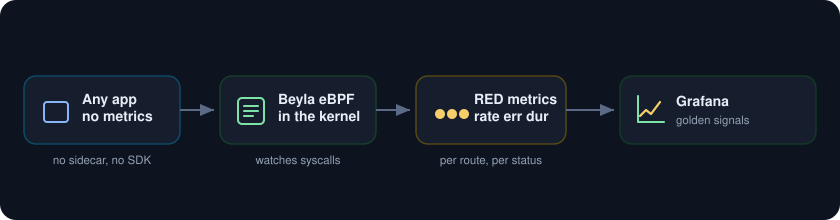
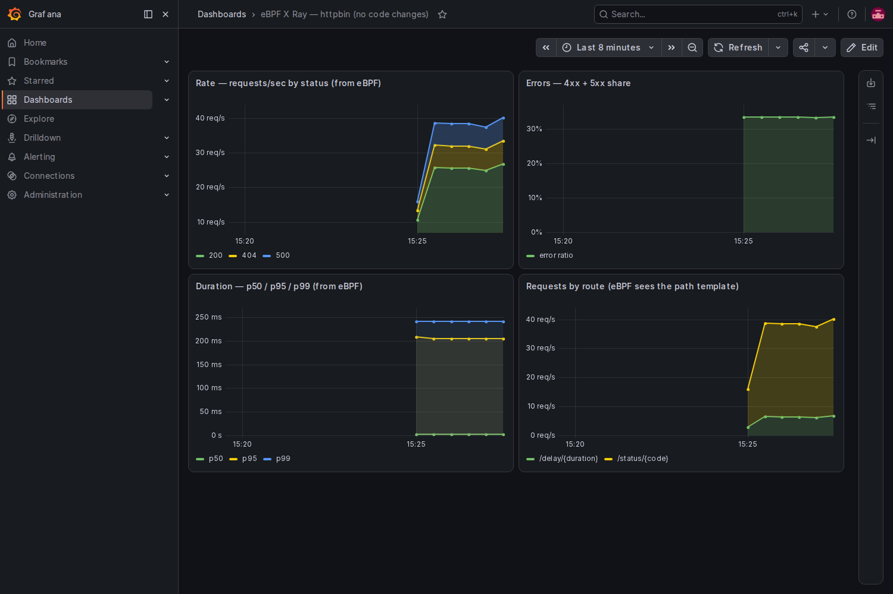

<p align="center">
  
</p>

Get the golden signals for every service in your cluster without touching a line of application code. Grafana Beyla rides on eBPF in the kernel, watches the syscalls behind each HTTP call, and emits RED metrics (rate, errors, duration) on its own. No sidecars, no SDKs, no redeploys. You instrument nothing and you see everything, including services you do not own.

<p align="center">
  
</p>

##  What you need

* A Google Cloud project with billing turned on.
* A service account key JSON file with Kubernetes Engine Admin rights. This is the only credential.
* The gcloud CLI with the `gke-gcloud-auth-plugin` component, plus `kubectl` and `helm`.
* About 8 vCPU of headroom. A two node `e2-standard-4` cluster is plenty.

##  Authenticate with the service account key

```
gcloud auth activate-service-account --key-file=service_account.json
gcloud config set project YOUR_PROJECT_ID
gcloud config set compute/zone us-central1-a
```

##  1. Create the cluster

The default GKE nodes run Container Optimized OS, which ships a recent kernel with eBPF on, so no special node config is needed.

```
gcloud container clusters create ebpf-lab \
  --zone us-central1-a \
  --num-nodes 2 --machine-type e2-standard-4 \
  --release-channel regular --enable-ip-alias --scopes cloud-platform

gcloud container clusters get-credentials ebpf-lab --zone us-central1-a
```

##  2. Install Prometheus and Grafana

```
helm repo add prometheus-community https://prometheus-community.github.io/helm-charts
helm repo add grafana https://grafana.github.io/helm-charts
helm repo update

kubectl create namespace monitoring
helm install kube-prometheus-stack prometheus-community/kube-prometheus-stack \
  -n monitoring -f kps-values.yaml --wait
```

##  3. Deploy an app that has no metrics

[app.yaml](app.yaml) runs `go-httpbin`, a plain HTTP service with no Prometheus endpoint of its own, plus a load generator that hits a mix of `/status/200`, `/status/404`, `/status/500`, and `/delay`. Every metric you see for it later will have come purely from eBPF.

```
kubectl apply -f app.yaml
```

##  4. Turn on the eBPF X ray

Install Beyla as a DaemonSet. It discovers the services in the `demo` namespace and attaches to them in the kernel. [beyla-values.yaml](beyla-values.yaml) sets the namespace discovery, a Prometheus export port, and Kubernetes metadata so each metric carries pod, deployment, and namespace labels.

```
helm install beyla grafana/beyla -n beyla --create-namespace -f beyla-values.yaml --wait
```

Beyla exports on its own port but does not register itself for scraping, so add a Service and a ServiceMonitor pointing at it. [beyla-scrape.yaml](beyla-scrape.yaml) does exactly that.

```
kubectl apply -f beyla-scrape.yaml
```

Within a scrape cycle you can watch it work in the logs, where it reports attaching to the httpbin process:

```
kubectl logs -n beyla ds/beyla | grep "instrumenting process"
# ... cmd=/bin/go-httpbin ... type=go ...
```

##  5. Read the golden signals it invented

Open Grafana and load the board. Nothing in httpbin was changed, yet the four RED panels fill in: request rate split by status code, the error share, latency percentiles, and traffic broken out by route. Beyla even recovers the path template, so `/status/500` and `/status/404` collapse into `/status/{code}` instead of exploding into a metric per URL.

```
kubectl port-forward -n monitoring svc/kube-prometheus-stack-grafana 3000:80
# open http://localhost:3000, user admin, password from kps-values.yaml
```

<p align="center">
  
</p>

On this run Beyla reported about 40 requests a second, a steady error share near a third from the injected 4xx and 5xx, and a p99 around 240 milliseconds driven by the delay endpoint. All of it from the kernel, none of it from the app.

##  Notes

* One DaemonSet covers every language. Beyla reads the traffic at the syscall level, so Go, Java, Python, Node, Rust, and anything else are all covered by the same install with no per app work.
* The metric name is OpenTelemetry semantic conventions: `http_server_request_duration_seconds` with labels like `http_response_status_code`, `http_route`, and `service_name`.
* Beyla can also emit trace spans and a service graph. Feed those to Tempo to jump from a slow RED panel straight to the trace.
* For a live network flow map on top of this, run the cluster with Cilium and Hubble. That is a heavier setup than the golden signals shown here, which need only the DaemonSet.
* To stop paying while idle, delete the cluster when you are done: `gcloud container clusters delete ebpf-lab --zone us-central1-a`.
