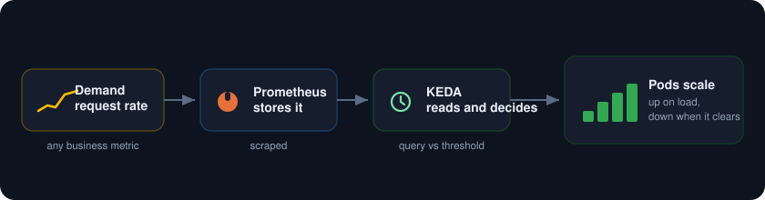
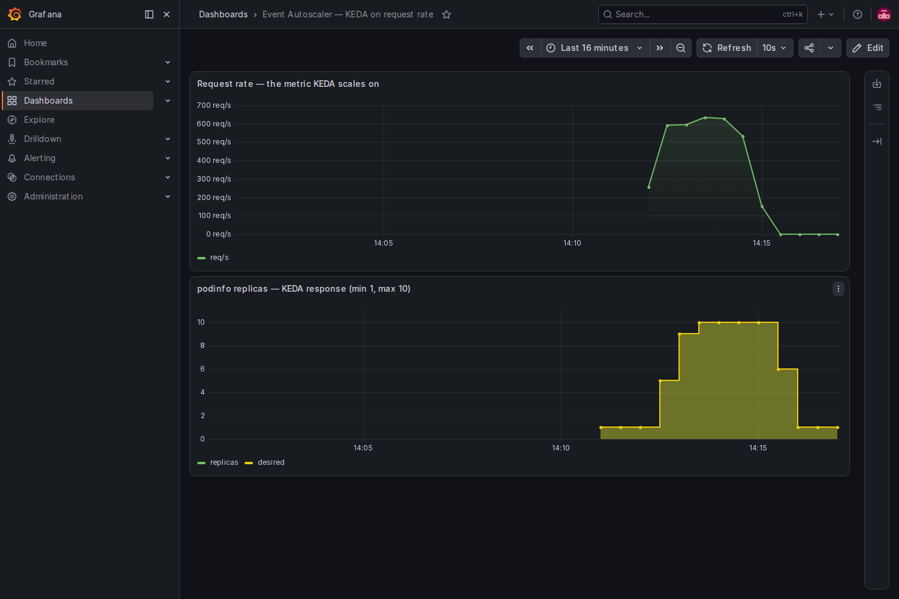

<p align="center">
  
</p>

Scale a workload on the metric you already chart, not on CPU. KEDA reads a Prometheus query, compares it to a threshold, and grows or shrinks the deployment to match. Point it at request rate, queue depth, or any number your business cares about, and the pod count tracks demand while the graph shows exactly when and why.

<p align="center">
  
</p>

##  What you need

* A Google Cloud project with billing turned on.
* A service account key JSON file with Kubernetes Engine Admin rights. This is the only credential.
* The gcloud CLI with the `gke-gcloud-auth-plugin` component, plus `kubectl` and `helm`.
* About 8 vCPU of headroom. A two node `e2-standard-4` cluster is plenty.

##  Authenticate with the service account key

```
gcloud auth activate-service-account --key-file=service_account.json
gcloud config set project YOUR_PROJECT_ID
gcloud config set compute/zone us-central1-a
```

##  1. Create the cluster

```
gcloud container clusters create keda-lab \
  --zone us-central1-a \
  --num-nodes 2 --machine-type e2-standard-4 \
  --release-channel regular --enable-ip-alias --scopes cloud-platform

gcloud container clusters get-credentials keda-lab --zone us-central1-a
```

##  2. Install Prometheus, Grafana, and KEDA

```
helm repo add prometheus-community https://prometheus-community.github.io/helm-charts
helm repo add kedacore https://kedacore.github.io/charts
helm repo update

kubectl create namespace monitoring
helm install kube-prometheus-stack prometheus-community/kube-prometheus-stack \
  -n monitoring -f kps-values.yaml --wait

helm install keda kedacore/keda -n keda --create-namespace --wait
```

##  3. Deploy the target and the scaler

[scaledobject.yaml](scaledobject.yaml) puts `podinfo` in a `demo` namespace with a ServiceMonitor, a load generator that starts at zero replicas, and the piece that matters, a KEDA ScaledObject. The ScaledObject does not watch CPU. It runs a Prometheus query for the request rate and scales podinfo so that each replica carries about 40 requests a second, between 1 and 10 pods.

```
  triggers:
  - type: prometheus
    metadata:
      serverAddress: http://kube-prometheus-stack-prometheus.monitoring.svc:9090
      query: sum(rate(http_request_duration_seconds_count{namespace="demo",path!~"healthz|readyz|livez"}[1m]))
      threshold: "40"
```

Apply it:

```
kubectl apply -f scaledobject.yaml
```

KEDA turns that trigger into a HorizontalPodAutoscaler behind the scenes. You can watch it:

```
kubectl get scaledobject,hpa -n demo
```

##  4. Create a demand wave

The load generator is just a deployment you scale up to make traffic. Turn it up to send a wave of requests, hold, then turn it back to zero.

```
kubectl scale deploy/loadgen -n demo --replicas=3   # load on
# wait a couple of minutes and watch podinfo grow
kubectl scale deploy/loadgen -n demo --replicas=0   # load off
```

As the request rate climbs, KEDA scales podinfo out. When the traffic stops, it scales back in.

##  5. Watch the pods track demand

Open Grafana and load the board. The top panel is the request rate, the metric KEDA is reading. The bottom panel is the podinfo replica count. Line them up and the story is plain: the rate rises and the pods step out behind it, one to five to ten, then step back down to one after the load clears.

```
kubectl port-forward -n monitoring svc/kube-prometheus-stack-grafana 3000:80
# open http://localhost:3000, user admin, password from kps-values.yaml
```

<p align="center">
  
</p>

The autoscaler is no longer a black box. The number that drives it is right there on the same screen.

##  Notes

* Same trick, any trigger. Swap the Prometheus query for Pub/Sub queue depth, Kafka lag, or anything KEDA supports, and the pods scale on that instead. KEDA ships more than 60 scalers.
* The threshold is per replica. KEDA aims for `query result / threshold` pods, so a threshold of 40 with 600 requests a second wants 15 pods, capped here at the max of 10.
* Set `minReplicaCount: 0` to scale a workload all the way to zero when idle. That is where the `pollingInterval` and `cooldownPeriod` fields start to matter.
* To stop paying while idle, delete the cluster when you are done: `gcloud container clusters delete keda-lab --zone us-central1-a`.
