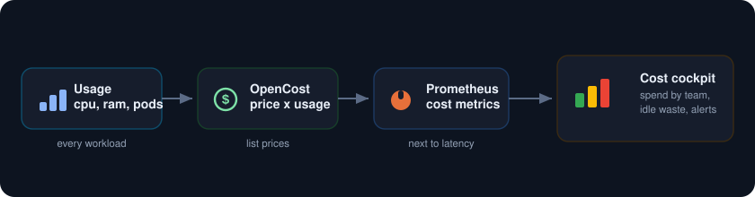
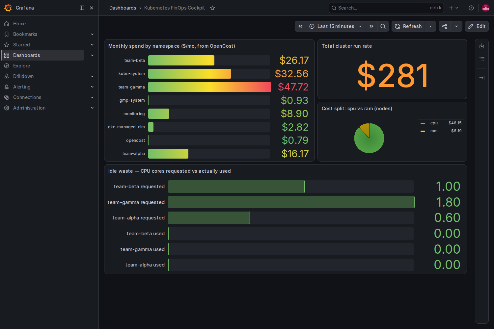

<p align="center">
  
</p>

Turn cluster cost into a live signal that sits right next to latency and errors. OpenCost prices every workload from cloud list rates, streams the numbers into Prometheus, and Grafana shows spend by namespace, by team, and by label in real time, with an idle panel that flags the money you are burning on nothing. Cost stops being something you reconcile a day late and becomes something you watch.

<p align="center">
  
</p>

##  What you need

* A Google Cloud project with billing turned on.
* A service account key JSON file with Kubernetes Engine Admin rights. This is the only credential.
* The gcloud CLI with the `gke-gcloud-auth-plugin` component, plus `kubectl` and `helm`.
* About 8 vCPU of headroom. A two node `e2-standard-4` cluster is plenty.

##  Authenticate with the service account key

```
gcloud auth activate-service-account --key-file=service_account.json
gcloud config set project YOUR_PROJECT_ID
gcloud config set compute/zone us-central1-a
```

##  1. Create the cluster

```
gcloud container clusters create finops-lab \
  --zone us-central1-a \
  --num-nodes 2 --machine-type e2-standard-4 \
  --release-channel regular --enable-ip-alias --scopes cloud-platform

gcloud container clusters get-credentials finops-lab --zone us-central1-a
```

##  2. Install Prometheus, Grafana, and OpenCost

```
helm repo add prometheus-community https://prometheus-community.github.io/helm-charts
helm repo add opencost https://opencost.github.io/opencost-helm-chart
helm repo update

kubectl create namespace monitoring
helm install kube-prometheus-stack prometheus-community/kube-prometheus-stack \
  -n monitoring -f kps-values.yaml --wait
```

OpenCost reads cluster usage from Prometheus and writes cost metrics back into it. [opencost-values.yaml](opencost-values.yaml) points it at the in cluster Prometheus and turns on a ServiceMonitor.

```
helm install opencost opencost/opencost -n opencost --create-namespace -f opencost-values.yaml --wait
```

##  3. Deploy some teams to bill

[workloads.yaml](workloads.yaml) creates three team namespaces. team-alpha and team-beta run real requests, and team-gamma is the villain: two pods that reserve nearly a core each and a gig of memory while doing absolutely nothing. That is the waste the cockpit is built to catch.

```
kubectl apply -f workloads.yaml
```

##  4. Read the cockpit

Give OpenCost a minute to price the cluster, then open Grafana. The bars break spend out by namespace, the stat shows the whole cluster run rate, the pie splits it into CPU and memory, and the bottom panel puts requested cores next to used cores.

```
kubectl port-forward -n monitoring svc/kube-prometheus-stack-grafana 3000:80
# open http://localhost:3000, user admin, password from kps-values.yaml
```

<p align="center">
  
</p>

The headline writes itself. **team-gamma is the most expensive namespace on the cluster, yet the idle panel shows it using essentially zero of the 1.8 cores it reserved.** That is a pod you can shrink or delete for pure savings, and here it is obvious instead of buried in a billing console.

##  Notes

* The core query joins allocation to node price: `container_cpu_allocation * on(node) group_left node_cpu_hourly_cost`, summed by namespace and multiplied by 730 hours to read as a month. Swap `namespace` for a team or product label to bill by whatever you tag.
* Cost splits by request, not by use, which is the point. A pod that reserves a core it never touches still costs a core, and the idle panel is where that shows up.
* OpenCost here uses cloud list prices. For exact figures wire it to the GCP billing export, and for long retention remote write the cost metrics to Mimir.
* Turn the idle gap into an alert: fire when a namespace requests far more than it uses over a day, and route it to the owning team.
* To stop paying while idle, delete the cluster when you are done: `gcloud container clusters delete finops-lab --zone us-central1-a`.
