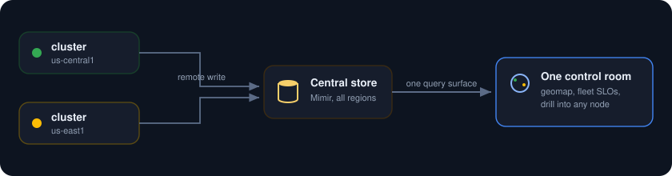
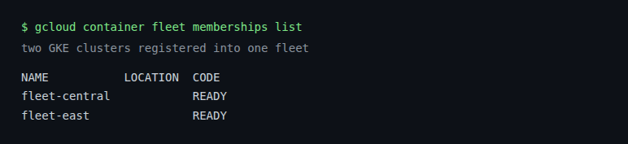
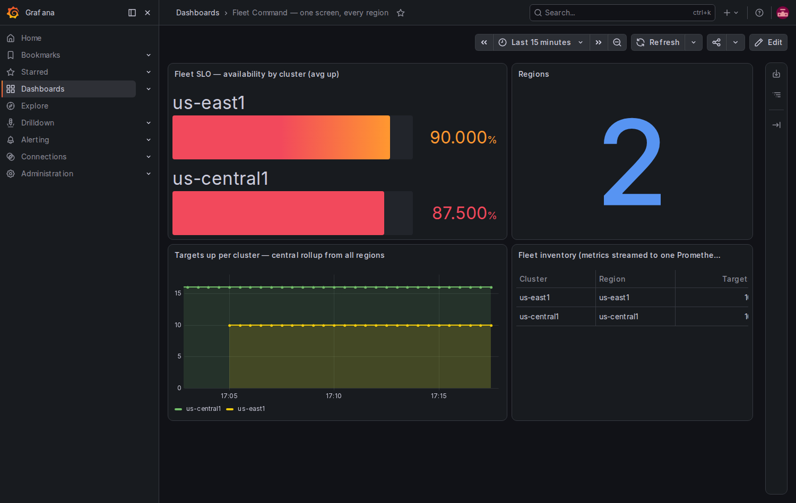

<p align="center">
  
</p>

Instead of one Grafana per cluster, build a global control room. Register your GKE clusters across regions into a Fleet, stream every cluster's metrics into one central store, and put the whole estate on a single Grafana board: fleet wide SLOs, a rollup by region, and the ability to drill from the globe down to a single node. It is the view a platform team actually wants at 3am.

<p align="center">
  
</p>

##  What you need

* A Google Cloud project with billing turned on.
* A service account key JSON file with Kubernetes Engine Admin and GKE Hub Admin rights.
* The gcloud CLI with the `gke-gcloud-auth-plugin` component, plus `kubectl` and `helm`.
* Two regions of quota. This lab runs one cluster in `us-central1` and one in `us-east1`.

##  Authenticate with the service account key

```
gcloud auth activate-service-account --key-file=service_account.json
gcloud config set project YOUR_PROJECT_ID
```

##  1. Create two clusters in two regions

The hub, in us-central1, holds the central metrics store and Grafana. The edge, in us-east1, only runs a Prometheus that ships its metrics to the hub.

```
gcloud container clusters create fleet-central \
  --zone us-central1-a --num-nodes 2 --machine-type e2-standard-4 --disk-size 50 \
  --release-channel regular --enable-ip-alias --scopes cloud-platform

gcloud container clusters create fleet-east \
  --zone us-east1-b --num-nodes 1 --machine-type e2-standard-4 --disk-size 50 \
  --release-channel regular --enable-ip-alias --scopes cloud-platform
```

##  2. Stand up the hub

On fleet-central, install kube-prometheus-stack with [kps-central.yaml](kps-central.yaml). Two settings make it the hub: the Prometheus service is a LoadBalancer so other clusters can reach it, and `enableRemoteWriteReceiver` lets it accept their metrics. Its `externalLabels` stamp `cluster`, `region`, and geo coordinates on everything.

```
gcloud container clusters get-credentials fleet-central --zone us-central1-a
kubectl create namespace monitoring
helm install kube-prometheus-stack prometheus-community/kube-prometheus-stack \
  -n monitoring -f kps-central.yaml --wait
kubectl get svc kube-prometheus-stack-prometheus -n monitoring   # note the external IP
```

##  3. Point the edge at the hub

On fleet-east, install a Grafana less kube-prometheus-stack that remote writes a small set of metrics to the hub's Prometheus IP. [kps-edge.yaml](kps-edge.yaml) sets that remote write URL and stamps this cluster's own `cluster`, `region`, and coordinates.

```
gcloud container clusters get-credentials fleet-east --zone us-east1-b
kubectl create namespace monitoring
# edit kps-edge.yaml: set the remoteWrite url to http://HUB_PROM_IP:9090/api/v1/write
helm install kube-prometheus-stack prometheus-community/kube-prometheus-stack \
  -n monitoring -f kps-edge.yaml --wait
```

Within a minute the hub's Prometheus is answering for both clusters. A query for `count by (cluster) (up)` returns `us-central1` and `us-east1` side by side, from one place.

##  4. Register the clusters into a Fleet

The metrics rollup already works. Registering the clusters into a GKE Fleet gives you the fleet identity and the Connect gateway for managing them as a group.

```
gcloud services enable gkehub.googleapis.com
gcloud container fleet memberships register fleet-central --gke-cluster=us-central1-a/fleet-central
gcloud container fleet memberships register fleet-east    --gke-cluster=us-east1-b/fleet-east
gcloud container fleet memberships list
```

<p align="center">
  
</p>

##  5. The control room

Open Grafana on the hub and load the board. Every panel spans both regions from the one central Prometheus: availability per cluster, the region count, the target rollup where you can watch both regions at once, and the fleet inventory.

```
kubectl port-forward -n monitoring svc/kube-prometheus-stack-grafana 3000:80
# open http://localhost:3000, user admin, password from kps-central.yaml
```

<p align="center">
  
</p>

Two clusters, two regions, one screen. Add a geomap layer with the `geo_lat` and `geo_lon` labels and each cluster drops onto the world map by where it runs.

##  Notes

* Prometheus only applies its `externalLabels` when data leaves the server, so a cluster's own metrics carry the `cluster` label at the hub over remote write, but not in a local query on that same cluster. The hub's own metrics get their label injected in the dashboard queries here for the same reason.
* Keep the remote write cheap. The edge here ships only a keep list of `up`, node, and pod metrics, not everything, which is usually all a fleet rollup needs.
* Swap the hub Prometheus for Mimir when the fleet grows. Mimir is built for many clusters remote writing into one multi tenant store with long retention on GCS, and Grafana keeps pointing at the same endpoint.
* The Fleet and its Connect gateway are what let you run commands and policies across every member without collecting a kubeconfig per cluster.
* To stop paying while idle, delete both clusters when done: `gcloud container clusters delete fleet-central --zone us-central1-a` and `gcloud container clusters delete fleet-east --zone us-east1-b`.
