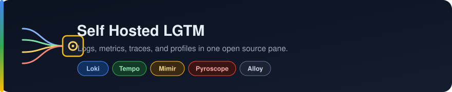
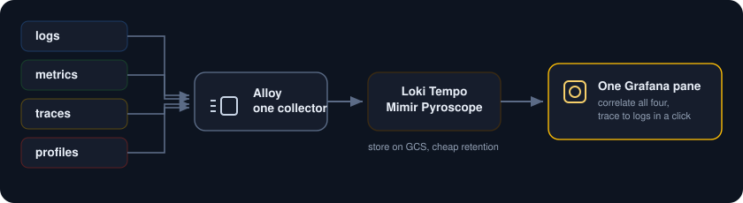
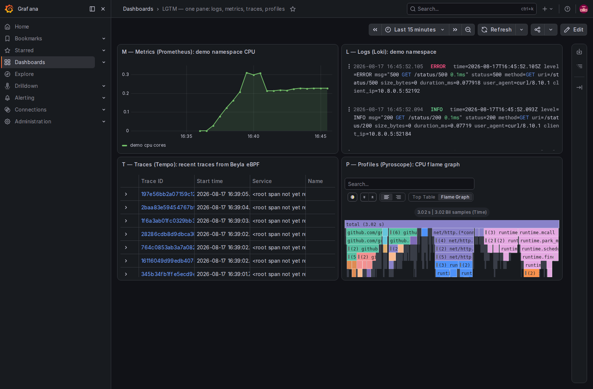

<p align="center">
  
</p>

Run the full Grafana observability stack on your own cluster: Loki for logs, Tempo for traces, a Prometheus compatible store for metrics, and Pyroscope for continuous profiles, with Grafana Alloy as the single collector. One coherent open source stack, one pane, and you move from a metric to a log to a trace to a flame graph without leaving the tab.

<p align="center">
  
</p>

##  What you need

* A Google Cloud project with billing turned on.
* A service account key JSON file with Kubernetes Engine Admin rights. This is the only credential.
* The gcloud CLI with the `gke-gcloud-auth-plugin` component, plus `kubectl` and `helm`.
* This stack is heavier than the others. Use **three** `e2-standard-4` nodes. The GKE default disk is 100 GB, and three of those blow past the 250 GB regional SSD quota, so pass `--disk-size 50`.

##  Authenticate with the service account key

```
gcloud auth activate-service-account --key-file=service_account.json
gcloud config set project YOUR_PROJECT_ID
gcloud config set compute/zone us-central1-a
```

##  1. Create the cluster

```
gcloud container clusters create lgtm-lab \
  --zone us-central1-a \
  --num-nodes 3 --machine-type e2-standard-4 --disk-size 50 \
  --release-channel regular --enable-ip-alias --scopes cloud-platform

gcloud container clusters get-credentials lgtm-lab --zone us-central1-a
```

##  2. Install the backends

Add the charts and make two namespaces, `lgtm` for the stack and `demo` for the app.

```
helm repo add grafana https://grafana.github.io/helm-charts
helm repo add prometheus-community https://prometheus-community.github.io/helm-charts
helm repo update
kubectl create namespace lgtm
kubectl create namespace monitoring
```

Install each backend in its light single node mode. The value files here disable the scale out components and the object storage caches so the whole thing fits the lab.

```
helm install loki      grafana/loki      -n lgtm -f loki-values.yaml --wait
helm install tempo     grafana/tempo     -n lgtm -f tempo-values.yaml --wait
helm install pyroscope grafana/pyroscope -n lgtm -f pyroscope-values.yaml --wait
```

Metrics and Grafana come from kube-prometheus-stack. Its values file [kps-values.yaml](kps-values.yaml) already wires Loki, Tempo, and Pyroscope in as Grafana data sources, and turns on trace to logs.

```
helm install kube-prometheus-stack prometheus-community/kube-prometheus-stack \
  -n monitoring -f kps-values.yaml --wait
```

> Loki 3 runs with a read only root filesystem, so its data path needs a volume. [loki-values.yaml](loki-values.yaml) gives it a small PVC. Without one it crash loops on `mkdir /var/loki: read-only file system`.

##  3. Wire up Alloy, the single collector

[alloy-values.yaml](alloy-values.yaml) runs Alloy as a DaemonSet that tails every pod's logs and ships them to Loki. Attributes are relabeled so each log line carries its namespace, pod, and container.

```
helm install alloy grafana/alloy -n lgtm -f alloy-values.yaml --wait
```

##  4. Give it something to observe

[app.yaml](app.yaml) runs go-httpbin and a load generator, and [beyla-values.yaml](beyla-values.yaml) runs Beyla, which generates distributed traces for the app from eBPF and sends them to Tempo, again with no app changes.

```
kubectl apply -f app.yaml
helm install beyla grafana/beyla -n demo -f beyla-values.yaml
```

Pyroscope ships its own Alloy that profiles the running processes, so the fourth signal fills in on its own.

##  5. All four signals, one pane

Open Grafana and load the board. Four panels, four backends, one screen: namespace CPU from the metrics store, the app's live access log from Loki, the trace list from Tempo, and a CPU flame graph from Pyroscope.

```
kubectl port-forward -n monitoring svc/kube-prometheus-stack-grafana 3000:80
# open http://localhost:3000, user admin, password from kps-values.yaml
```

<p align="center">
  
</p>

Because Tempo is wired to Loki, a trace in that list is one click from the exact log lines it produced. That is the whole promise of the stack, and it is running on open source you host yourself.

##  Notes

* This lab uses filesystem and small PVC storage so it stands alone. In production, point Loki, Tempo, Mimir, and Pyroscope at GCS buckets, where long retention is cheap and the components can scale out.
* The metrics role here is filled by the Prometheus that ships with kube-prometheus-stack. Swap in Mimir when you need horizontal scale and multi tenancy for metrics, and Grafana keeps pointing at the same place.
* Logs and traces come from Alloy and Beyla with no application instrumentation. For richer traces, add an OpenTelemetry SDK and send spans straight to Tempo.
* Grafana 13 adds drilldown and git synced dashboards, so the board itself can live in a repo.
* To stop paying while idle, delete the cluster when you are done: `gcloud container clusters delete lgtm-lab --zone us-central1-a`.
