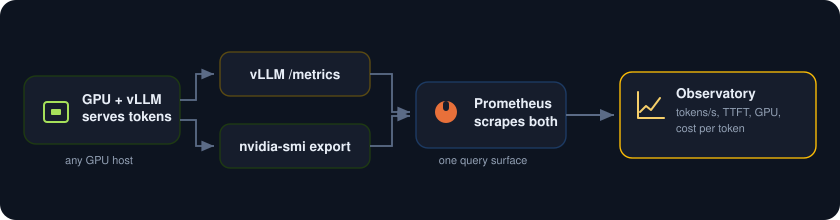
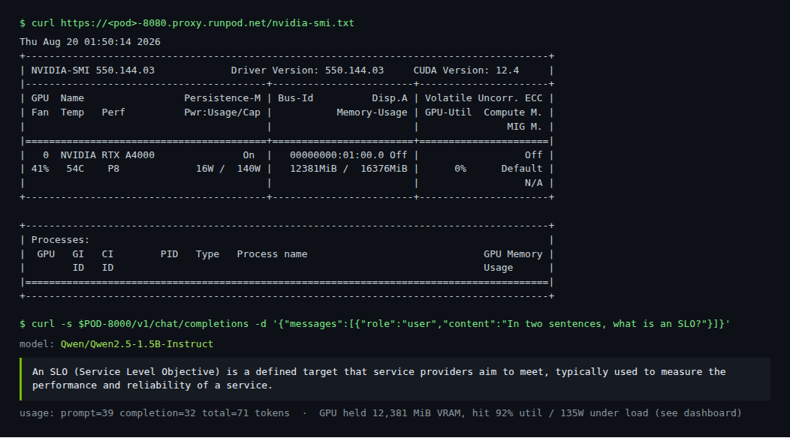
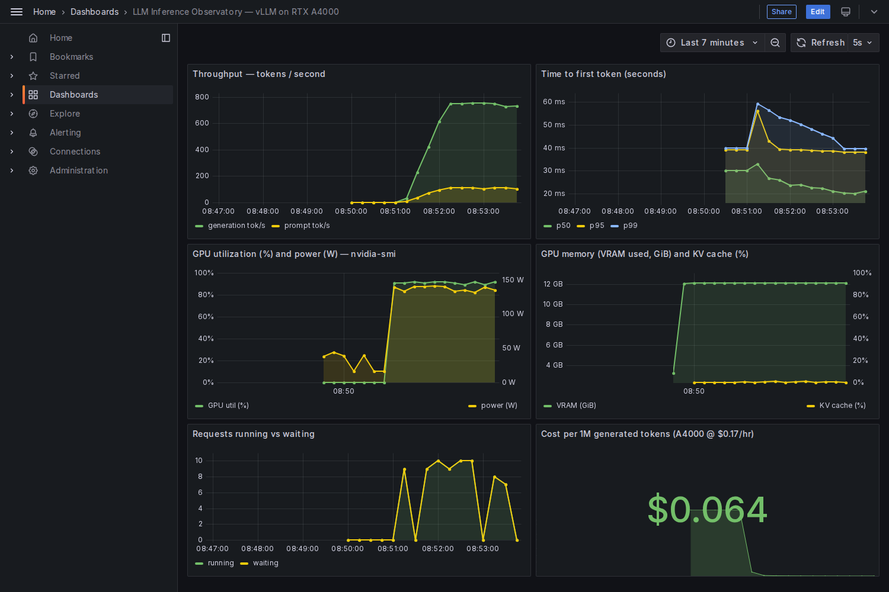

<p align="center">
  
</p>

Serve your own open-source LLM on a GPU and turn the raw hardware counters into product signals. vLLM runs the model and exports rich Prometheus metrics, an nvidia-smi exporter adds the GPU counters, Prometheus scrapes both, and Grafana shows a mission-control board: tokens per second, time to first token, GPU utilization and VRAM, the request queue, and cost per million tokens. Your inference platform finally speaks the language of the people paying for it.

<p align="center">
  
</p>

> Validated live on a single **NVIDIA RTX A4000 (16 GB)** GPU. It runs on any GPU host: this repo includes launchers for AWS ([launch.py](launch.py)) and GCP ([launch_gcp.py](launch_gcp.py)), plus the exact start script used on RunPod ([runpod-start.sh](runpod-start.sh)) since both AWS and GCP declined the GPU quota from zero for this test. The stack itself ([stack/](stack)) is a plain `docker compose` and is cloud-agnostic.

##  What you need

* Any box with one NVIDIA GPU (T4/A4000 class is plenty for a small model), the NVIDIA driver, Docker, and the NVIDIA container runtime. A Deep Learning VM image or a RunPod GPU pod already has all of this.
* About 8 GB of VRAM for a 1.5B model; more lets you serve bigger models.

##  1. Get a GPU

Fastest with no quota dance is a GPU host like RunPod. On a hyperscaler you need GPU quota first (both AWS and GCP start you at zero and review a request), then `launch.py` / `launch_gcp.py` boot a T4 box and run the stack in user-data.

##  2. Bring up the stack

[stack/docker-compose.yml](stack/docker-compose.yml) runs five things: **vLLM** serving an OpenAI-compatible endpoint (with Prometheus metrics on `:8000`), the **nvidia-smi exporter** for GPU counters, **Prometheus**, **Grafana** (auto-provisioned with the observatory dashboard), and a **load generator**.

```
cd stack
docker compose up -d
# Grafana on :3000 (admin / llmobs), vLLM on :8000/v1
```

The model (Qwen2.5-1.5B by default) downloads and loads onto the GPU in about a minute.

##  3. Confirm it is really on the GPU

`nvidia-smi` shows the model resident in VRAM, and the OpenAI endpoint answers a prompt for real:

<p align="center">
  
</p>

The A4000 is holding **12.4 GiB** of VRAM for the model, and vLLM returns a correct answer with its token usage. Under load the same GPU runs at **92% utilization drawing 135 W** of its 140 W cap.

##  4. Watch the observatory

Open Grafana and load the board, then send traffic. Six panels turn the counters into signals: throughput climbs past 700 tokens a second, time to first token holds in the tens of milliseconds, the GPU utilization and power track the load, VRAM sits flat while the KV cache fills, the request queue breathes, and the cost panel prices every million tokens from the hourly GPU rate divided by throughput.

<p align="center">
  
</p>

On this run the A4000 sustained about **750 tokens/second at roughly $0.064 per million generated tokens**. That single number, cost per token, is the one product and finance actually care about, and here it is live next to the latency.

##  Notes

* vLLM exposes the whole inference story on its own: `vllm:generation_tokens_total`, `vllm:time_to_first_token_seconds`, `vllm:time_per_output_token_seconds`, `vllm:num_requests_running` and `_waiting`, and `vllm:gpu_cache_usage_perc` for the KV cache.
* GPU counters here come from the nvidia-smi exporter, which works in any container that can see the GPU. In a Kubernetes cluster with privileged access, swap it for the NVIDIA DCGM exporter for richer per-SM and NVLink metrics.
* The cost panel is just `hourly_price / 3600 / tokens_per_second * 1e6`. Change the price to your instance and it re-prices itself.
* To scale this to production on Kubernetes, put vLLM behind KServe or KubeAI, autoscale replicas with KEDA on `vllm:num_requests_waiting`, and point the same Grafana at the fleet.
