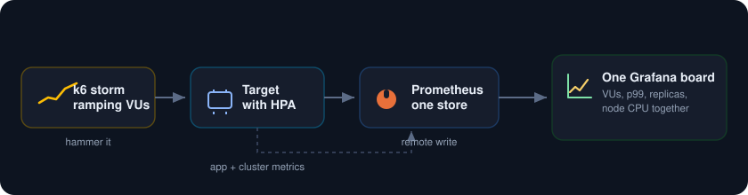
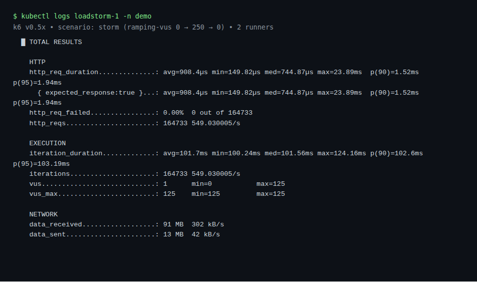
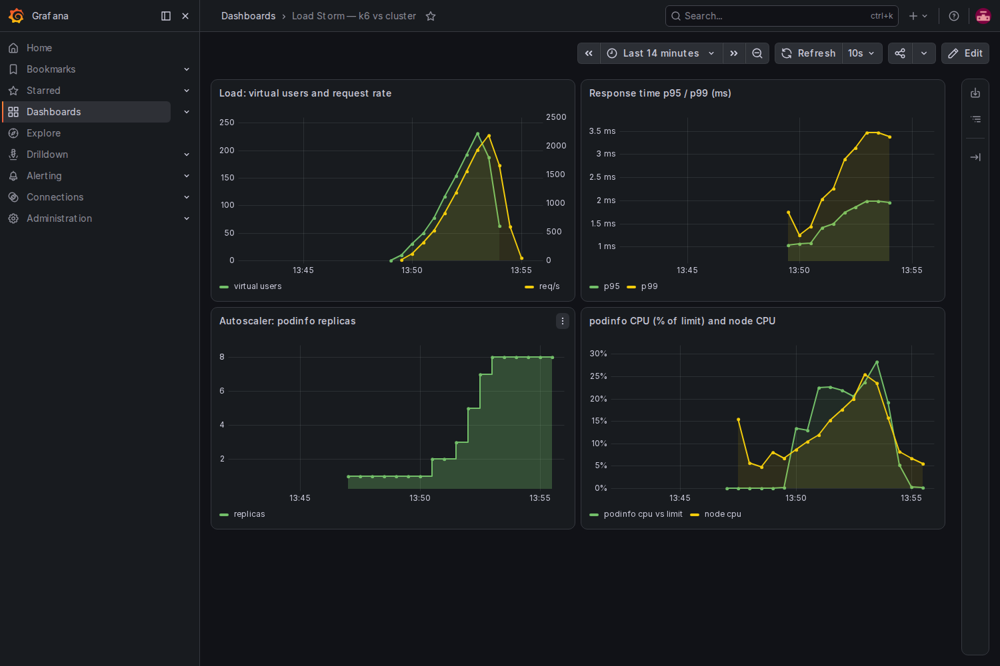

<p align="center">
  
</p>

Run a load test from inside the cluster with Grafana k6, stream its results into the same Prometheus that watches the cluster, and put both on one Grafana board. As the virtual users climb you see request rate, p99 latency, autoscaler replicas, and node CPU move together, so you find the exact point where the system bends.

<p align="center">
  
</p>

##  What you need

* A Google Cloud project with billing turned on.
* A service account key JSON file with Kubernetes Engine Admin rights. This is the only credential.
* The gcloud CLI with the `gke-gcloud-auth-plugin` component, plus `kubectl` and `helm`.
* About 8 vCPU of headroom. A two node `e2-standard-4` cluster is plenty.

##  Authenticate with the service account key

```
gcloud auth activate-service-account --key-file=service_account.json
gcloud config set project YOUR_PROJECT_ID
gcloud config set compute/zone us-central1-a
```

##  1. Create the cluster

```
gcloud container clusters create loadstorm-lab \
  --zone us-central1-a \
  --num-nodes 2 --machine-type e2-standard-4 \
  --release-channel regular --enable-ip-alias \
  --scopes cloud-platform

gcloud container clusters get-credentials loadstorm-lab --zone us-central1-a
```

##  2. Install Prometheus, Grafana, and the k6 operator

Add the charts:

```
helm repo add prometheus-community https://prometheus-community.github.io/helm-charts
helm repo add grafana https://grafana.github.io/helm-charts
helm repo update
```

Install the monitoring stack. The one setting that matters here is the remote write receiver, so Prometheus will accept the metrics k6 pushes into it. It is turned on in [kps-values.yaml](kps-values.yaml) with `enableRemoteWriteReceiver: true`.

```
kubectl create namespace monitoring
helm install kube-prometheus-stack prometheus-community/kube-prometheus-stack \
  -n monitoring -f kps-values.yaml --wait
```

Install the k6 operator. It runs load tests as Kubernetes jobs and splits the work across runners.

```
helm install k6-operator grafana/k6-operator \
  -n k6-operator-system --create-namespace --wait
```

##  3. Deploy the target with an autoscaler

[target.yaml](target.yaml) puts `podinfo` in a `demo` namespace with a small CPU limit, a ServiceMonitor so Prometheus scrapes it, and a HorizontalPodAutoscaler set to scale from 1 to 8 pods at 50 percent CPU. That autoscaler is what turns a load test into a story about the cluster reacting.

```
kubectl apply -f target.yaml
```

##  4. Run the storm

[k6.yaml](k6.yaml) holds the test script and a TestRun. The script ramps virtual users from 0 to 250 and back over five minutes, hitting the target the whole time. The TestRun points k6 at the Prometheus remote write endpoint so every k6 metric lands next to the cluster metrics.

```
kubectl apply -f k6.yaml
kubectl get testrun loadstorm -n demo -w
```

Two runner pods start, the load climbs, and when the run ends k6 prints its summary. On this run it drove 250 virtual users, held around 2,100 requests a second at the peak, and every request came back clean.

<p align="center">
  
</p>

##  5. Watch it bend on one board

Open Grafana and load the board. Because the load generator and the cluster report to the same Prometheus, cause and effect sit side by side. The virtual users climb, the request rate tracks them, the autoscaler steps podinfo from one pod up to eight, and p99 latency creeps up as the system fills. When the load drops, everything unwinds.

```
kubectl port-forward -n monitoring svc/kube-prometheus-stack-grafana 3000:80
# open http://localhost:3000, user admin, password from kps-values.yaml
```

<p align="center">
  
</p>

Top left is the storm itself, the ramp of virtual users and the request rate riding with it. Top right is p95 and p99 latency bending upward as concurrency builds. Bottom left is the autoscaler stepping the target from one pod to eight. Bottom right is CPU on the pods and the node. Read across the four and you can point at the knee.

##  Notes

* k6 exports its trend metrics in seconds over remote write, so set the latency panel unit to seconds and Grafana renders the small values as milliseconds on its own.
* Give the autoscaler something to chew on. A tiny CPU limit on the target means real load pushes utilization past the target fast, so the scaling is visible instead of theoretical.
* Turn `parallelism` up in the TestRun to generate more load. Each runner is a separate pod, and the peak virtual user count is split across them.
* To stop paying while idle, delete the cluster when you are done: `gcloud container clusters delete loadstorm-lab --zone us-central1-a`.
