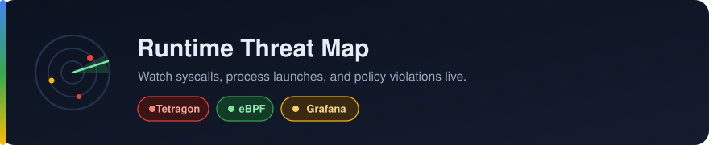
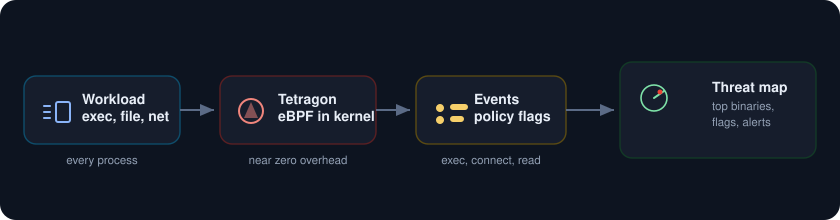
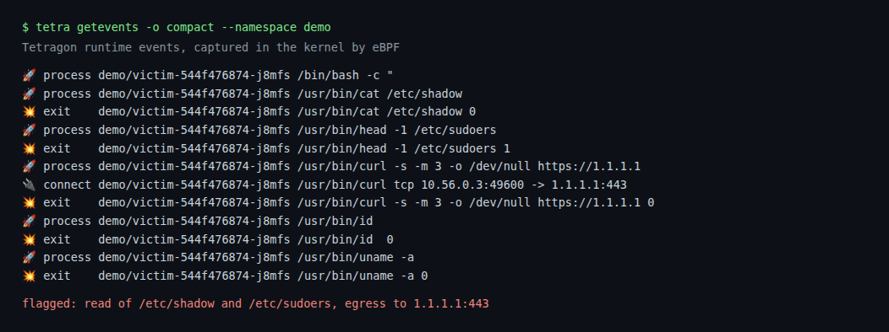
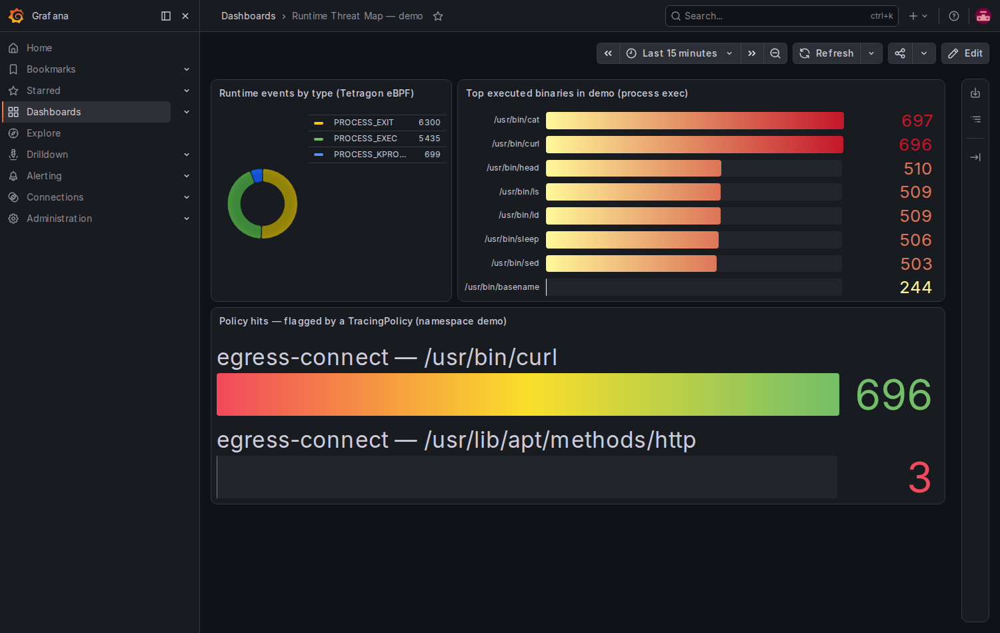

<p align="center">
  
</p>

Watch process launches, file reads, and network connections across the cluster in real time, in the kernel, at almost no overhead. Cilium Tetragon rides on eBPF, TracingPolicies flag the behaviour you care about like a read of `/etc/shadow` or an unexpected egress, and Grafana turns the stream into a live threat map that sits right next to your ops dashboards.

<p align="center">
  
</p>

##  What you need

* A Google Cloud project with billing turned on.
* A service account key JSON file with Kubernetes Engine Admin rights. This is the only credential.
* The gcloud CLI with the `gke-gcloud-auth-plugin` component, plus `kubectl` and `helm`.
* About 8 vCPU of headroom. A two node `e2-standard-4` cluster is plenty.

##  Authenticate with the service account key

```
gcloud auth activate-service-account --key-file=service_account.json
gcloud config set project YOUR_PROJECT_ID
gcloud config set compute/zone us-central1-a
```

##  1. Create the cluster

```
gcloud container clusters create threat-lab \
  --zone us-central1-a \
  --num-nodes 2 --machine-type e2-standard-4 \
  --release-channel regular --enable-ip-alias --scopes cloud-platform

gcloud container clusters get-credentials threat-lab --zone us-central1-a
```

##  2. Install Prometheus, Grafana, and Tetragon

```
helm repo add prometheus-community https://prometheus-community.github.io/helm-charts
helm repo add cilium https://helm.cilium.io
helm repo update

kubectl create namespace monitoring
helm install kube-prometheus-stack prometheus-community/kube-prometheus-stack \
  -n monitoring -f kps-values.yaml --wait

helm install tetragon cilium/tetragon -n kube-system -f tetragon-values.yaml --wait
```

The Tetragon values turn on its Prometheus metrics and a ServiceMonitor, so the event counts flow into the same Prometheus.

##  3. Load the tracing policies

[tracingpolicy.yaml](tracingpolicy.yaml) adds two rules: one flags reads of sensitive files like `/etc/shadow` and `/etc/sudoers`, the other flags outbound TCP to anything outside the private ranges. These are what turn raw activity into a flagged threat.

```
kubectl apply -f tracingpolicy.yaml
```

##  4. Make some noise

[victim.yaml](victim.yaml) and [attacker.yaml](attacker.yaml) run pods that do exactly the things an intruder would: read the shadow file, poke at sudoers and the ssh config, and curl out to the internet.

```
kubectl apply -f victim.yaml
kubectl apply -f attacker.yaml
```

Watch the events stream out of the kernel with the tetra CLI:

```
kubectl exec -n kube-system ds/tetragon -c tetragon -- \
  tetra getevents -o compact --namespace demo
```

Every exec, exit, and flagged connection shows up with the pod and the full command line.

<p align="center">
  
</p>

##  5. The threat map

Open Grafana and load the board. The donut breaks the events into exec, exit, and kprobe. The bar list is the top binaries seen in the namespace, which reads like a recon script: cat, curl, head, ls, id. The bottom panel is the money one, the policy hits, where the egress rule caught curl reaching out over and over.

```
kubectl port-forward -n monitoring svc/kube-prometheus-stack-grafana 3000:80
# open http://localhost:3000, user admin, password from kps-values.yaml
```

<p align="center">
  
</p>

Security and reliability finally share one screen. The same Grafana that shows your latency now shows an unexpected shell reaching for the shadow file.

##  Notes

* Tetragon runs in the kernel, so it sees every process on the node whether or not the workload cooperates, and it cannot be hidden from by an app.
* Aggregate counts live in Prometheus for the dashboard. For the full event with arguments and the process ancestry, read the raw stream with tetra or ship it to Loki for search and retention.
* The metric label set is rich: `tetragon_events_total` carries `type` and `binary`, and `tetragon_policy_events_total` carries the `policy` name and the offending `binary`, which is what the flagged panel groups on.
* Alert on the high risk patterns: a shell spawned in a container that never runs one, a read of a secret file, or egress to a brand new address.
* To stop paying while idle, delete the cluster when you are done: `gcloud container clusters delete threat-lab --zone us-central1-a`.
