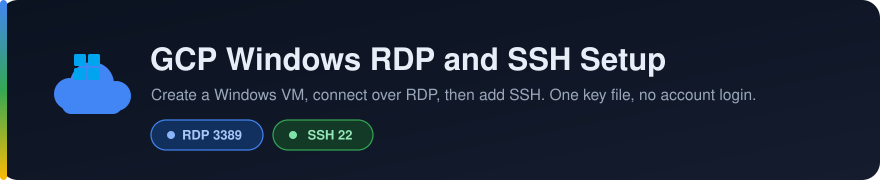
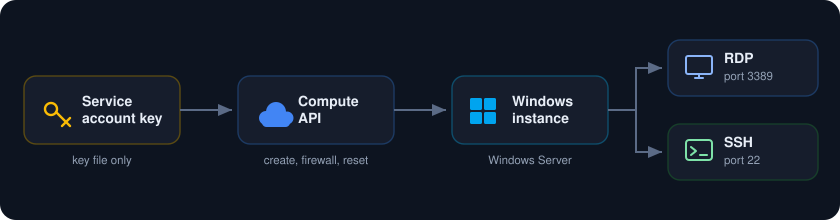
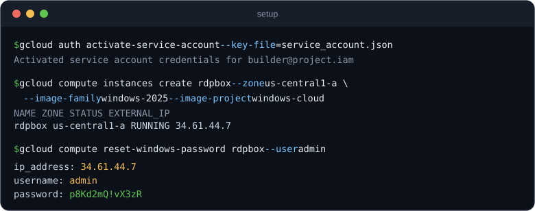
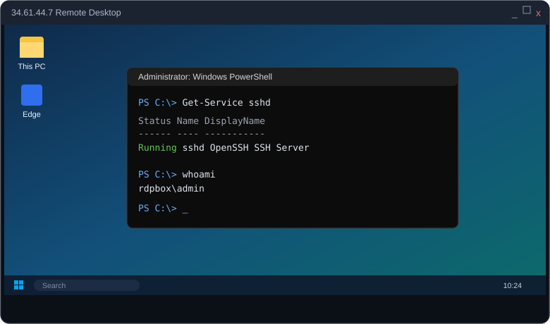
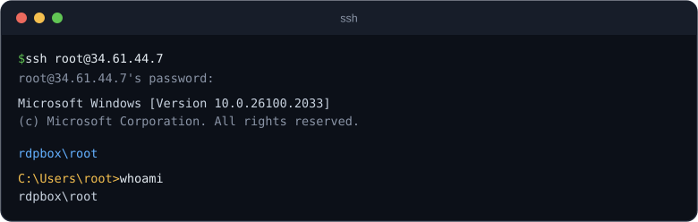

<p align="center">
  
</p>

A guide to create a Windows instance on Google Cloud, get RDP access to it, then add SSH access to the same instance.

<p align="center">
  
</p>

##  What you need

* A Google Cloud project with billing turned on.
* A service account key JSON file with Compute Admin rights on that project. This is the only credential. You never log into a Google account and no browser is involved.
* The gcloud CLI installed. It only needs the key file, not an account login.
* An RDP client such as Windows Remote Desktop.

##  Authenticate with the service account key

Point gcloud at the key file and set the project. There is no sign in prompt and no browser step.

```
gcloud auth activate-service-account --key-file=service_account.json
gcloud config set project YOUR_PROJECT_ID
```

Every gcloud command below then runs as that service account.

If you want no CLI at all, the same steps work directly against the Compute REST API by loading the key in code. That is the path that was actually used here. In Python it is just:

```
from google.oauth2 import service_account
from google.auth.transport.requests import AuthorizedSession

creds = service_account.Credentials.from_service_account_file(
    "service_account.json", scopes=["https://www.googleapis.com/auth/cloud-platform"])
session = AuthorizedSession(creds)
# session.post(...) and session.get(...) against
# https://compute.googleapis.com/compute/v1/projects/PROJECT/...
```

Both ways use only the key file. Pick whichever you like. The rest of this guide shows the gcloud form for readability.

##  1. Create the Windows instance

Pick a name, a zone, a machine type, and a Windows image. Example:

```
gcloud compute instances create rdpbox \
  --zone us-central1-a \
  --machine-type e2-standard-4 \
  --image-family windows-2025 \
  --image-project windows-cloud \
  --boot-disk-size 80GB \
  --boot-disk-type pd-ssd
```

The instance gets an external IP automatically. Note that IP, you will connect to it.

If you use the Compute REST API with a service account instead of gcloud, the same values go in the JSON body: the name, the machineType, a disk that points at the `windows-cloud` source image, and a network interface with an access config so it gets a public IP.

<p align="center">
  
</p>

##  2. Open RDP and SSH in the firewall

On the default network these two rules usually already exist:

* default allow rdp opens tcp 3389
* default allow ssh opens tcp 22

Check what you have:

```
gcloud compute firewall-rules list
```

If they are missing, add them:

```
gcloud compute firewall-rules create allowrdp --allow tcp:3389 --source-ranges 0.0.0.0/0
gcloud compute firewall-rules create allowssh --allow tcp:22 --source-ranges 0.0.0.0/0
```

##  3. Get the Windows password

A fresh Windows instance has no known password. Reset it and read the new one:

```
gcloud compute reset-windows-password rdpbox --zone us-central1-a --user admin
```

This prints the external IP, the username, and a new password. Keep all three.

For reference, this works in three steps. gcloud writes a public key to the instance metadata under the key named `windows-keys`. The guest agent inside Windows encrypts a new password and writes it to serial port 4. gcloud reads that serial port and decrypts the value with the matching private key. If you ever do it by hand with the API you follow those same three steps.

##  4. Connect over RDP

Open your RDP client, enter the external IP, then sign in as admin with the password from step 3. You now have the full Windows desktop.

<p align="center">
  
</p>

##  5. Add SSH to the Windows instance

Open PowerShell as Administrator inside the RDP session and run the blocks below.

Install and start the OpenSSH server:

```
Add-WindowsCapability -Online -Name OpenSSH.Server~~~~0.0.1.0
Set-Service -Name sshd -StartupType Automatic
Start-Service sshd
```

Open the Windows firewall for port 22:

```
New-NetFirewallRule -Name sshd -DisplayName "OpenSSH Server" -Enabled True -Direction Inbound -Protocol TCP -Action Allow -LocalPort 22
```

Create the SSH user and make it an administrator. Change the name and the password to your own:

```
$pw = ConvertTo-SecureString "YourStrongPassword" -AsPlainText -Force
New-LocalUser -Name root -Password $pw -PasswordNeverExpires -AccountNeverExpires
Add-LocalGroupMember -Group Administrators -Member root
```

Make sure password login is allowed, then restart the service:

```
$cfg = "C:\ProgramData\ssh\sshd_config"
(Get-Content $cfg) -replace "^#?PasswordAuthentication.*","PasswordAuthentication yes" | Set-Content $cfg
Restart-Service sshd
```

The service is set to Automatic, so it comes back on every reboot and the SSH access survives restarts.

##  6. Optional, set up SSH without touching the desktop

If you do not want to open the desktop at all, run the same commands as SYSTEM through a startup script.

Save the PowerShell from step 5 into a file called setup.ps1, then attach it and reboot:

```
gcloud compute instances add-metadata rdpbox \
  --zone us-central1-a \
  --metadata-from-file windows-startup-script-ps1=setup.ps1

gcloud compute instances reset rdpbox --zone us-central1-a
```

The instance reboots, the guest agent runs the script as SYSTEM with full rights, and SSH is ready when it comes back up. Once it works, clear the metadata so the script does not run on every boot:

```
gcloud compute instances remove-metadata rdpbox --zone us-central1-a --keys windows-startup-script-ps1
```

##  7. Connect over SSH

```
ssh root@EXTERNAL_IP
```

Enter the password you set. The default shell is cmd. Type powershell if you want a PowerShell session.

<p align="center">
  
</p>

##  Notes

* In this guide both RDP on 3389 and SSH on 22 are open to the whole internet. For anything real, set the source ranges to your own IP only.
* Too many failed RDP logins can lock the account. You can clear that over SSH with net accounts /lockoutthreshold:0 and then net user admin "YourPassword".
* To stop paying while idle, stop the instance with `gcloud compute instances stop rdpbox --zone us-central1-a`, or delete it when you are done.
